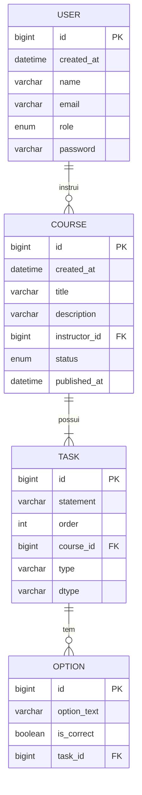

# AluraFake API

## Visão Geral
Aplicação RESTful para gerenciamento de cursos e atividades interativas, desenvolvida em Java 18+, Spring Boot, Spring Data JPA e MySQL. Utiliza Flyway para versionamento de esquema e Spring Security (Basic Auth) para proteção de endpoints.

## Estrutura do Projeto

- **package br.com.alura.AluraFake.course**
    - `Course` (entidade JPA)
    - `Status` (enum: BUILDING, PUBLISHED)
    - `CourseRepository` (Spring Data JPA)
    - `CourseService` (lógica de negócio para publication)
    - `CourseController` (endpoints `/course`)
    - DTOs: `NewCourseDTO`, `CourseListItemDTO`, etc.

- **package br.com.alura.AluraFake.user**
    - `User` (entidade JPA)
    - `Role` (enum: STUDENT, INSTRUCTOR)
    - `UserRepository` (Spring Data JPA), etc.

- **package br.com.alura.AluraFake.task**
    - `Task` (superclasse abstrata, herança por dtype)
    - `OpenTextTask`, `SingleChoiceTask`, `MultipleChoiceTask` (subclasses)
    - `Option` (entidade para alternativas)
    - `TaskRepository`, `TaskService`, `TaskController`
    - DTOs para criação de tasks: `NewOpenTextTaskDTO`, `NewSingleChoiceTaskDTO`, `NewMultipleChoiceTaskDTO`, etc.

- **package br.com.alura.AluraFake.infra**
    - `DataSeeder` (popula dados iniciais em profile `dev`)

- **package br.com.alura.AluraFake.config**
    - `SecurityConfig` (configuração Spring Security + OpenAPI/Swagger)

- **Flyway migrations** em `src/main/resources/db/migration`:
    - V1__create_user.sql
    - V2__create_course.sql
    - V3__create_tasks.sql
    - V4__create_options.sql

## Banco de Dados e Mapeamento

### Tabelas

```sql
-- Usuário\CREATE TABLE User (
  id BIGINT AUTO_INCREMENT PRIMARY KEY,
  createdAt DATETIME DEFAULT CURRENT_TIMESTAMP,
  name VARCHAR(50) NOT NULL,
  email VARCHAR(50) NOT NULL UNIQUE,
  role ENUM('STUDENT', 'INSTRUCTOR') NOT NULL DEFAULT 'STUDENT',
  password VARCHAR(20) NOT NULL
);

-- Curso
CREATE TABLE Course (
  id BIGINT AUTO_INCREMENT PRIMARY KEY,
  createdAt DATETIME DEFAULT CURRENT_TIMESTAMP,
  title VARCHAR(50) NOT NULL,
  description VARCHAR(255) NOT NULL,
  instructor_id BIGINT NOT NULL,
  status ENUM('BUILDING','PUBLISHED') NOT NULL DEFAULT 'BUILDING',
  publishedAt DATETIME NULL,
  FOREIGN KEY (instructor_id) REFERENCES User(id) ON DELETE CASCADE
);

-- Atividades (Tasks)
CREATE TABLE tasks (
  id BIGINT AUTO_INCREMENT PRIMARY KEY,
  statement VARCHAR(255) NOT NULL,
  `order` INT NOT NULL,
  course_id BIGINT NOT NULL,
  type VARCHAR(20) NOT NULL,
  dtype VARCHAR(31) NOT NULL,
  UNIQUE (course_id, statement),
  FOREIGN KEY (course_id) REFERENCES Course(id)
);

-- Opções (Options)
CREATE TABLE options (
  id BIGINT AUTO_INCREMENT PRIMARY KEY,
  option_text VARCHAR(80) NOT NULL,
  is_correct BOOLEAN NOT NULL,
  task_id BIGINT NOT NULL,
  FOREIGN KEY (task_id) REFERENCES tasks(id) ON DELETE CASCADE
);
```  

### Diagrama de Entidades

Abaixo está o diagrama das tabelas e seus relacionamentos



---


## Endpoints

### Autenticação
HTTP Basic Auth. Apenas usuários com **Role.INSTRUCTOR** podem criar ou publicar.

#### Usuários iniciais (profile `dev`)
- `caio@alura.com.br` / senha gerada (STUDENT)
- `paulo@alura.com.br` / senha gerada (INSTRUCTOR)

### Course

| Método | Endpoint                  | Acesso       | Descrição                                                 |
| ------ | ------------------------- | ------------ | --------------------------------------------------------- |
| POST   | `/course/new`             | INSTRUCTOR   | Cria novo curso (`NewCourseDTO`).                         |
| GET    | `/course/all`             | autenticado  | Lista todos os cursos (`CourseListItemDTO`).              |
| POST   | `/course/{id}/publish`    | INSTRUCTOR   | Publica curso, valida regras e define `publishedAt`.     |

**Exemplo criação**
```json
POST /course/new
{
  "title": "Java 18+",
  "description": "Curso atualizado",
  "emailInstructor": "paulo@alura.com.br"
}
-> 201 Created
```

**Publicação**
```
POST /course/42/publish -> 204 No Content
```

### Task

| Método | Endpoint                         | Acesso       | Descrição                                                           |
| ------ | -------------------------------- | ------------ | ------------------------------------------------------------------- |
| POST   | `/task/new/opentext`             | INSTRUCTOR   | Cria Open Text Task (`NewOpenTextTaskDTO`).                         |
| POST   | `/task/new/singlechoice`        | INSTRUCTOR   | Cria Single Choice Task (`NewSingleChoiceTaskDTO`).                 |
| POST   | `/task/new/multiplechoice`      | INSTRUCTOR   | Cria Multiple Choice Task (`NewMultipleChoiceTaskDTO`).             |

#### Exemplo Single Choice
```json
POST /task/new/singlechoice
{
  "courseId": 42,
  "statement": "O que aprendemos?",
  "order": 2,
  "options": [
    {"option": "Java", "isCorrect": true},
    {"option": "Python", "isCorrect": false}
  ]
}
-> 201 Created
```

## Regras de Validação

1. **General**
    - `statement`: mínimo 4, máximo 255 caracteres.
    - Nenhuma duplicidade de `statement` por `courseId`.
    - `order` positivo, sequência contínua sem saltos.
    - `Course.status` deve ser BUILDING para aceitar novas tasks.

2. **Single Choice**
    - 2 ≤ número de opções ≤ 5.
    - Exatamente 1 `isCorrect = true`.
    - Cada `option_text`: 4–80 caracteres, distinto entre si e diferente de `statement`.

3. **Multiple Choice**
    - 3 ≤ número de opções ≤ 5.
    - ≥2 `isCorrect = true` e pelo menos 1 `false`.
    - Mesmas regras de tamanho e unicidade.

4. **Inserção**
    - Se `order` já existir, desloca tasks existentes para manter sequência.

## Testes Automatizados

- **Unit Tests** em `src/test/java` cobrindo:
    - `UserRepositoryTest`, `PasswordGenerationTest`
    - `CourseServiceTest`, `CourseControllerTest`
    - `TaskServiceTest`, `TaskControllerTest`

- **Integração** com banco de teste (`application-test.properties`) e Flyway.

## Swagger / OpenAPI
Acesse `http://localhost:8080/swagger-ui.html` para explorar a documentação interativa.

---

> Documentação criada para o Case Técnico Alura. Basta copiar este arquivo como `README.md` na raiz do projeto.

